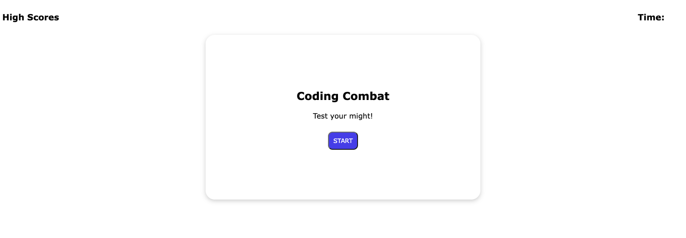

# JavaScript Code Quiz
A timed coding quiz to test JavaScript knowledge.

## Description

The application allows a user to take a timed quiz and record their initials and completion time (score) at the end.

Watch out: Any incorrect answers will reduce your time by 5 seconds (resulting in a loss of 5 points)!

The game will end if you answer all questions successfully of you run out of time (whichever comes first).

Please see 'Usage' for instructions.

## Usage

1. Navigate to the website on [Github Pages](https://exzilium.github.io/code-quiz/)
2. Click "Start" to begin the quiz. Take note of the timer in the upper right!
3. Read each question and select from one of the 4 multiple choice answers
4. When the quiz is complete you will enter your initials to be recoreded with your score.
5. Your scores can be revsited anytime by clicking the "High Scores" button from the starting page.

## Credits

- MDN web docs for [JavaScript](https://developer.mozilla.org/en-US/docs/Web/JavaScript)

## License

N/A
